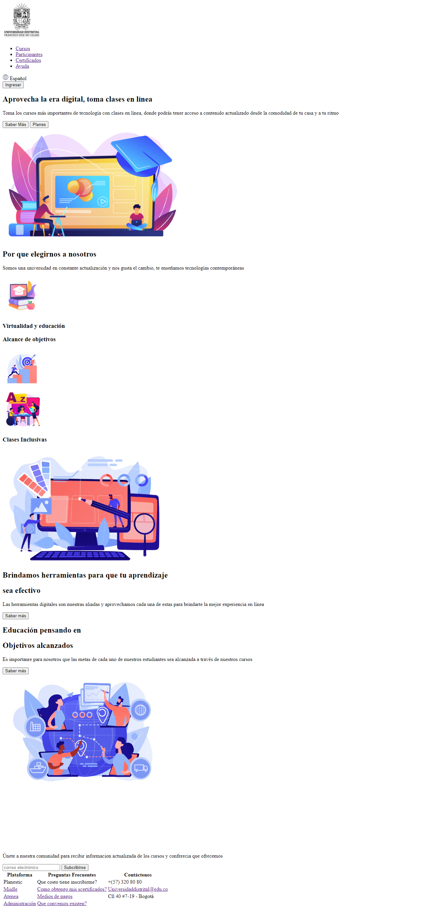
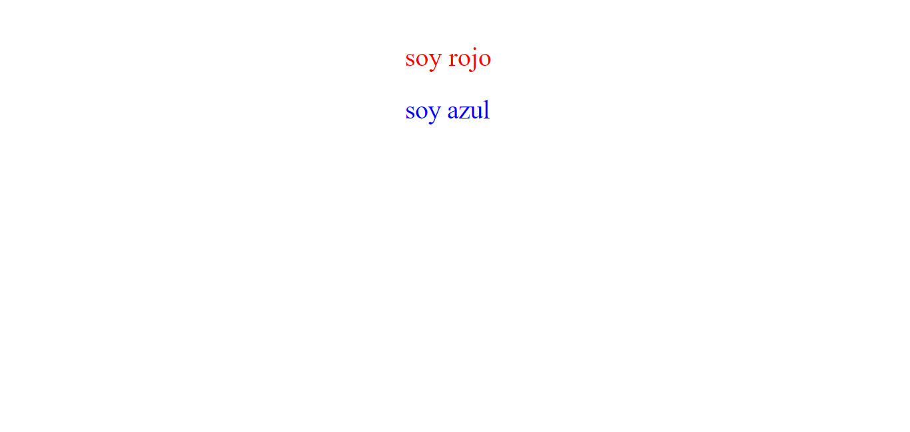
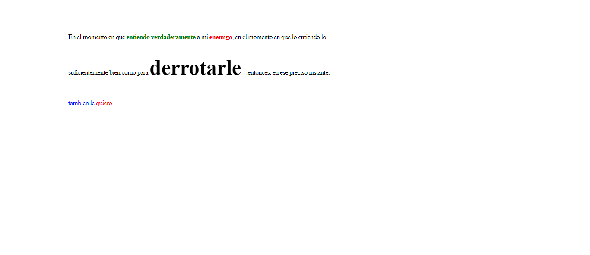

<h1>Taller 9: Silvia Marmolejo</h1>

<h2>Información</h2>

Curso: Full Starck Básico - Grupo 1

Profesor: Cristian Patiño

<h2>Punto 1: Link de figma</h2>
<a href="https://www.figma.com/file/ffE2jKaRmWRNXCfLlhhEkz/silvia-marmolejo-figma-excer?type=design&node-id=0%3A1&t=8WqlVWDdvolgY4xU-1">Link de figma</a>

<h2>Punti 2: html</h2>

<h2>punto 3: css</h2>

<h2>punto 4: html<h2>

<h2>punto 5: html</h2>

